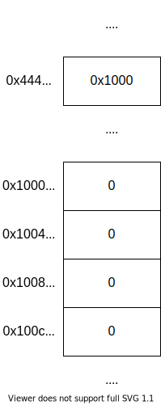
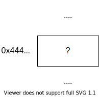
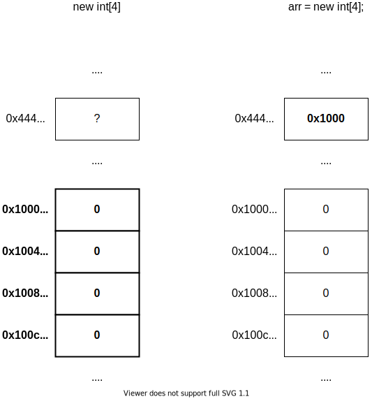
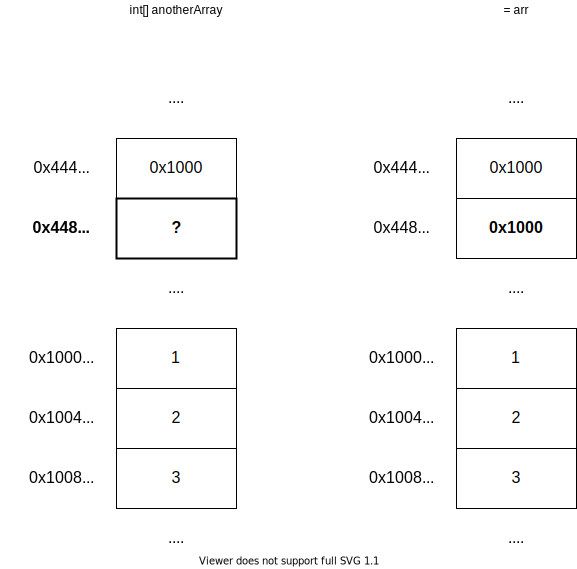
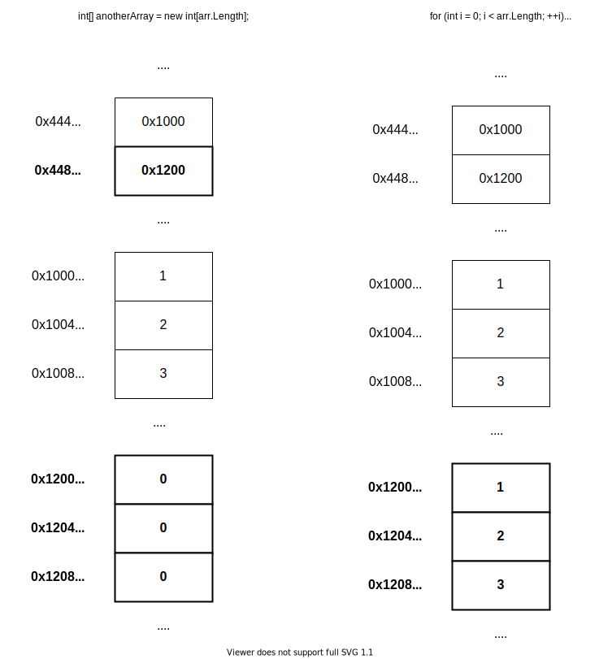

## Ngôn ngữ lập trình C#
Ngôn ngữ lập trình được dùng để viết chương trình **cho con người có thể đọc**.

C# là ngôn ngữ lập trình bậc cao, tức là code của nó gần với con người hơn,
dễ đọc hiểu hơn. Bậc ở đây không phải chỉ độ mạnh yếu mà là chỉ mức trừu tượng.
- Ở mức mã máy (thấp nhất) thì chương trình chỉ là một chuỗi bit.
- Với hợp ngữ (assembly) thì chương trình là một dãy các chỉ thị cực kỳ đơn giản
như cộng, trừ, nhân chia, chép giá trị từ chỗ này sang chỗ khác, nhảy đến một
địa chỉ và tiếp tục chạy chương trình từ chỗ đó, ...
- Những ngôn ngữ lập trình như C hay Pascal thì bắt đầu có các hàm, các kiểu
dữ liệu, các câu lệnh rẽ nhánh, câu lệnh lặp, ... Nhờ mấy cái này mà chương
trình có thể trở nên gần giống với câu văn trong ngôn ngữ tự nhiên, ví dụ như
`if answer = correctAnswer then increaseScore`.
- Vấn đề đọc hiểu đã được giải quyết phần nào nhờ mấy cái tính năng của ngôn ngữ
lập trình thời trước như C hay Pascal, nhưng mà mấy cái ngôn ngữ đó quá đơn giản,
với lại nhiều thứ không có sẵn, nên là có những ngôn ngữ mới hơn ra đời, C# là một
trong số đó. Mấy ngôn ngữ này phức tạp hơn (tại vì có nhiều tính năng hơn), bù lại
là chương trình viết ra sẽ càng gần với ngôn ngữ tự nhiên hơn, ví dụ như bên C# có
thể viết `foreach (var item in theList)`, bỏ qua chữ `var` thì nó chính là một câu
tiếng Anh (không hoàn chỉnh nhưng) đúng ngữ pháp: for each item in the list (với mỗi
mục trong danh sách).

Máy tính không trực tiếp thực thi chương trình viết bằng C#, để chạy được cần phải
biên dịch (compile) ra dạng mà máy có thể thực thi được. Nếu code không đúng cú pháp
thì lúc biên dịch sẽ gặp lỗi, kêu là lỗi biên dịch (compile error). Nếu chương trình
không có lỗi biên dịch nhưng mà tới lúc chạy gặp lỗi thì lỗi đó kêu là lỗi thực thi
(runtime error, chữ runtime tách ra để đọc hiểu, run là chạy, time là thời điểm,
ghép lại là lỗi lúc chạy).

## Hello world
Dưới này là chương trình Hello world viết bằng C#

```c#
using System;

namespace Application
{
	class Program
	{
		/* Chương trình bắt đầu chạy từ đây */
		static void Main()
		{
			// In ra dòng chữ "Hello world"
			Console.WriteLine("Hello world");
			Console.WriteLine("This program is written in C#");
		}
	}
}
```

Tạm bỏ qua dòng `using` và `namespace` (sẽ nói cụ thể ở phần [Namespace](#Namespace)).

Chương trình trong C# luôn được viết trong một lớp (`class`, phần này cũng sẽ được nói sau).

`static void Main()` là dòng khai báo một phương thức (method) tĩnh (`static`) có tên là `Main`.
Phương thức đặt tên gì cũng được, nhưng mà chương trình luôn bắt đầu chạy từ `Main()` nên thiếu
nó là không chạy được.

Các câu lệnh sẽ được thực thi theo hướng từ trên xuống.

Phần viết bên trong `/*` `*/` hoặc từ `//` đến hết dòng là chú thích (comment),
sẽ bị bỏ qua khi chạy chương trình. Chú thích dùng để viết **cho con người đọc**,
thường xài để giải thích lý do. Chú thích viết bằng `/*` `*/` không lồng nhau.

Các dòng `Console.WriteLine` trong `Main()` gọi là câu lệnh. Câu lệnh được dùng
để mô tả một hành động nào đó, ở đây hành động được mô tả là in ra màn hình. Câu
lệnh kết thúc bằng dấu chấm phẩy `;`

`Console` là một lớp có sẵn trong thư viện chuẩn của C#, dùng cho nhập xuất cơ bản
trên giao diện dòng lệnh (mấy cái như `cmd` hoặc `PowerShell` của Windows).
`WriteLine` là một phương thức của lớp `Console`, xài để in giá trị ra màn hình, sau
khi in xong sẽ in kèm ký tự xuống dòng.

Phần viết bên trong cặp `"` gọi là chuỗi (string). Cặp dấu `"` dùng để đánh dấu vị trí
bắt đầu và kết thúc của chuỗi, `"abc"` là chuỗi chứa 3 ký tự `a`, `b` và `c`, cặp dấu `"`
chỉ là để đánh dấu vị trí bắt đầu và kết thúc, không phải nội dung của chuỗi.

## Câu lệnh, giá trị, phép toán
Câu lệnh để thể hiện một hành động nào đó có tạo ra ảnh hưởng. Ảnh hưởng ở đây có thể là
giá trị trên bộ nhớ được sửa đổi, dữ liệu được gửi đi (ví dụ câu lệnh in ra màn hình) hoặc
nhận về, ...

Giá trị có thể là những thứ đơn giản như `1` (số nguyên), `3.14` (số thực), `"abc"`
(chuỗi), cũng có thể là kết quả của phép tính phức tạp, ví dụ `1 + 2 * 3.14 / (3 - 4)`.

Mấy cái như cộng, trừ, nhân, chia gọi chung là phép toán hoặc toán tử (operator).
C# xài ký tự `+`, `-`, `*`, `/` cho 4 phép toán này, ngoài ra có thêm `%` cho phép
chia lấy phần dư. Giá trị tham gia vào phép toán được gọi là toán hạng (operand).
Ví dụ như `1 + 2` thì `+` là toán tử còn `1` với `2` là toán hạng.

## Kiểu dữ liệu, biến
Mọi giá trị trong C# đều có kiểu dữ liệu (data type) của nó. Kiểu dữ liệu nó là một
tập hợp các giá trị và các phép toán cho mấy cái giá trị đó. Ví dụ như kiểu `byte`
(một kiểu số nguyên không âm trong C#) là tập hợp chứa các số từ `0` tới `255`, biến
biến thuộc kiểu này có thể chứa số bất kỳ từ `0` tới `255`. Kiểu `byte` cũng có các
phép toán như cộng, trừ, nhân, chia nên nếu có 2 giá trị thuộc kiểu `byte` có thể cộng
2 giá trị đó để cho ra giá trị mới.

C# có các kiểu dữ liệu cơ bản này:
- Số nguyên: Được phân ra làm số nguyên có dấu (signed, tức là có thể chứa giá trị âm)
và số nguyên không dấu (không thể chứa giá trị âm). Kiểu số nguyên chủ yếu được dùng là
kiểu `int`, các kiểu khác có thể xem ở
https://docs.microsoft.com/en-us/dotnet/csharp/language-reference/builtin-types/integral-numeric-types
- Số thực: Tất cả các kiểu số thực đều là số có dấu (tức là có thể chứa số âm), thường
chỉ dùng `float` hoặc `double`. Xem chi tiết ở
https://docs.microsoft.com/en-us/dotnet/csharp/language-reference/builtin-types/floating-point-numeric-types
- Boolean: Tên trong C# là `bool`. Kiểu này chỉ có 2 giá trị là `true` và `false`.
- Ký tự: Tên kiểu trong C# là `char`, dùng để chứa một ký tự Unicode (câu này không
hoàn toàn đúng, nhưng mà nếu giải thích rõ ra thì hơi dài nên cứ coi như nó đúng đi).
- Chuỗi: Tên kiểu là string, dùng để chứa 0 hoặc nhiều ký tự.

Biến (variable) là một vùng trên bộ nhớ được đặt tên, xài để chứa giá trị thuộc một
kiểu nào đó được xác định trước, giá trị của cái vùng nhớ đó có thể thay đổi (cho nên
nó mới được gọi là biến, chữ biến trong biến đổi ấy). Tên biến là để con người đọc
thôi chứ máy nó không quan tâm, nên là chọn tên sao cho có ý nghĩa tí.

Khai báo biến theo cú pháp `<kiểu> <tên>;` với `<kiểu>` là tên kiểu dữ liệu, `<tên>` là
tên biến.
```c#
int paymentPerHour; // Biến kiểu số nguyên có dấu, tên là paymentPerHour
int hoursWorked;
```

Lần đầu tiên gán giá trị cho biến được gọi là khởi tạo. Có thể khởi tạo ngay sau khi
khai báo biến luôn:

```c#
int paymentPerHour = 20000;
int hoursWorked = 80;
```

Có thể sử dụng biến với các phép toán mà kiểu của nó có (ví dụ số nguyên có phép toán
cộng, trừ, nhân, chia, chia dư, ...)

```c#
int paymentPerHour = 20000;
int hoursWorked = 80;
// Biến paymentPerHour và hoursWorked thuộc kiểu số nguyên nên có thể nhân
int wage = paymentPerHour * hoursWorked;
```

## Nhập xuất với `Console`
In ra màn hình bằng `Console.Write()` hoặc `Console.WriteLine()`.
Write chỉ in giá trị được truyền vào rồi thôi, còn WriteLine sau khi
in giá trị xong sẽ in thêm 1 ký tự xuống dòng.

Viết giá trị muốn in vào trong cặp ngoặc tròn, mỗi lần chỉ được
in 1 giá trị. Muốn in nhiều giá trị thì viết nhiều câu lệnh,
mỗi lần truyền 1 giá trị.

```c#
// Đoạn chương trình trên in ra `Helloworld` (không có khoảng trắng ở giữa).
// `Console.Write()` chỉ in cái được truyền vào, không in thêm gì khác.
// Sau `world` có ký tự xuống dòng do `Console.WriteLine()` in kèm.
Console.Write("Hello");
Console.WriteLine("world");
```

Đọc 1 dòng từ bàn phím bằng `Console.ReadLine()`, kết quả được đưa về
dưới dạng chuỗi.

Để chuyển chuỗi đọc được sang kiểu khác, có thể dùng lớp `Convert`,
lớp này có các phương thức như `ToInt32()` để chuyển sang kiểu `int`,
`ToDouble()` để sang kiểu `double`

```c#
string name = Console.ReadLine();
int age = Convert.ToInt32(Console.ReadLine());
double weightInKg = Convert.ToDouble(Console.ReadLine());
```

Lưu ý là đoạn code trên chỉ đọc vào chứ không in ra, nên lúc chạy sẽ thấy như chương trình
không phản hồi người dùng. Để người dùng biết cần nhập gì, cần in thông báo ra trước:

```c#
Console.Write("Your name: ");
string name = Console.ReadLine();
Console.Write("Your age: ");
int age = Convert.ToInt32(Console.ReadLine());
Console.Write("Your weight in kg: ");
double weightInKg = Convert.ToDouble(Console.ReadLine());
Console.WriteLine("Here is what you entered:");
Console.Write("		 Name: ");
Console.WriteLine(name);
Console.Write("		 Age: ");
Console.WriteLine(age);
Console.Write("		 Weight: ");
Console.Write(weightInKg);
Console.WriteLine(" kg");
```

In từng giá trị như trên sẽ rất phiền phức, nên `Console` có cho phép dùng
`Write` và `WriteLine` theo một cách khác ngắn gọn hơn:

```c#
Console.Write("Your name: ");
string name = Console.ReadLine();
Console.Write("Your age: ");
int age = Convert.ToInt32(Console.ReadLine());
Console.Write("Your weight in kg: ");
double weightInKg = Convert.ToDouble(Console.ReadLine());
Console.WriteLine("Here is what you entered:");
Console.WriteLine("		 Name: {0}", name);
Console.WriteLine("		 Age: {0}", age);
Console.WriteLine("		 Weight: {0} kg", weightInKg);
```

Chuỗi đầu tiên được gọi là chuỗi định dạng (format string), tức là chuỗi dùng để
mô tả kết quả sau khi in sẽ ra cái gì. Phía sau có thể truyền bao nhiêu giá trị
cũng được, giá trị đầu tiên có số thứ tự là 0 và sẽ được dùng để thế vào `{0}`
trong chuỗi định dạng. Một giá trị có thể dùng nhiều lần trong chuỗi định dạng:

```c#
Console.WriteLine("{0}{1}{0}", 'a', 'b'); // In ra "aba"
```

## Mảng
### Khai báo và khởi tạo
Biến thuộc các kiểu dữ liệu ở phía trước chỉ lưu một giá trị. Khi cần
lưu nhiều giá trị thì không thể cứ khai báo biến cho từng giá trị được,
lúc này cần dùng tới mảng (array).

Kiểu mảng là kiểu có thể chứa nhiều giá trị cùng kiểu dữ liệu. Kích thước
của mảng là cố định khi nó được tạo ra. Các giá trị bên trong mảng gọi là
phần tử (element).

Tên kiểu mảng có dạng `T[]` với `T` là tên của kiểu phần tử, ví dụ:
`int[]` là kiểu mảng với các phần tử là số nguyên.

Không giống với những kiểu đơn giản như `int` hay `float`, biến kiểu mảng
không trực tiếp chứa dữ liệu, dữ liệu được lưu ở chỗ khác trên bộ nhớ.
Biến thuộc kiểu mảng chỉ chứa địa chỉ của nơi lưu các phần tử mảng mà thôi.



Nhìn hình bên trên có thể thấy, các phần tử của mảng được lưu ở địa chỉ từ
`0x1000` về sau còn biến `arr` lại nằm ở địa chỉ `0x444`.

Để sử dụng mảng, trước hết cần khai báo một biến kiểu mảng để chỉ tới vùng
lưu giá trị các phần tử.

```c#
int[] arr;
```



Sau đó là tạo mảng mới bằng toán tử `new`, lúc này bộ nhớ sẽ được cấp cho
chương trình để lưu các phần tử của mảng, cho nên trong cặp ngoặc vuông cần
phải có kích thước cụ thể của mảng.

```c#
int[] arr;
// Cấp phát 1 vùng nhớ đủ chứa 4 phần tử kiểu int và cho `arr` trỏ đến
arr = new int[4]; 
```



Có thể kết hợp 2 bước khai báo và khởi tạo lại
```c#
int[] arr = new int[4];
```

Đọc/ghi giá trị từng phần tử trong mảng bằng toán tử `[]`, trong cặp ngoặc vuông
ghi chỉ số (index) của phần tử cần truy cập, phần tử đầu của mảng có chỉ số là `0`.

```c#
int[] arr = new int[4];
arr[0] = 123;
arr[1] = 456;
arr[2] = 789;
arr[3] = 0;
Console.WriteLine("{0} {1} {2} {3}", arr[0], arr[1], arr[2], arr[3]);
```

Khi dùng `new`, các phần tử của mảng đều được khởi tạo bằng giá trị
mặc định của kiểu, đối với kiểu số thì giá trị mặc định là `0`, kiểu
`bool` là `false`, kiểu đối tượng là `null`, ... Vậy cho nên dòng
`arr[3] = 0` bên trên có thể loại bỏ mà không làm thay đổi ý nghĩa
của chương trình.

```c#
int[] arr = new int[4];
arr[0] = 123;
arr[1] = 456;
arr[2] = 789;
Console.WriteLine("{0} {1} {2} {3}", arr[0], arr[1], arr[2], arr[3]);
```

Có thể khởi tạo giá trị các phần tử ngay khi cấp phát bộ nhớ bằng `new`

```c#
int[] arr = new int[4] { 123, 456, 789, 0 };
Console.WriteLine("{0} {1} {2} {3}", arr[0], arr[1], arr[2], arr[3]);
```

Nếu trong cặp ngoặc nhọn có đủ giá trị cho tất cả các phần tử đều thì
có thể bỏ trống kích thước mảng, trình biên dịch nó tự biết đếm số phần
tử trong cặp ngoặc nhọn.

```c#
// arr vẫn là mảng 4 phần tử
int[] arr = new int[] { 123, 456, 789, 0 };
Console.WriteLine("{0} {1} {2} {3}", arr[0], arr[1], arr[2], arr[3]);
```

`new int[] { 123, 456, 789, 0 }` tạo một mảng và khởi tạo cho các phần tử
của nó bằng những giá trị được ghi trong cặp ngoặc nhọn.

Nếu khởi tạo giá trị các phần tử của mảng ngay khi khai báo biến kiểu mảng thì
có thể bỏ qua `new` luôn

```c#
int[] arr = { 123, 456, 789, 0 };
Console.WriteLine("{0} {1} {2} {3}", arr[0], arr[1], arr[2], arr[3]);
```

Trong trường hợp biến đã được khai báo trước đó thì không bỏ `new` được
```c#
int[] arr;
// Nếu viết như dòng này sẽ bị lỗi biên dịch
// arr = { 123, 456, 789, 0 }; 
arr = new int[] { 123, 456, 789, 0 };
Console.WriteLine("{0} {1} {2} {3}", arr[0], arr[1], arr[2], arr[3]);
```

Lưu ý là trong trường hợp không khởi tạo tất cả phần tử trong mảng thì không thể
bỏ qua kích thước mảng, nếu không sẽ làm thay đổi ý nghĩa chương trình.

```c#
int[] arr1 = new int[4] { 1, 2, 3 }; // Mảng 4 phần tử 1, 2, 3, 0
int[] arr2 = new int[] { 1, 2, 3 }; // Mảng 3 phần tử 1, 2, 3
int[] arr3 = { 1, 2, 3 }; // Như trên, mảng 3 phần tử 1, 2, 3
```

### Duyệt qua mảng
Kích thước của mảng (số phần tử) được lưu trong thuộc tính (property) `Length`.

```c#
int[] arr = new int[4];
Console.WriteLine("Length of arr = {0}", arr.Length);
```

Có thể dùng `foreach` để duyệt qua từng phần tử trong mảng, hoặc dùng `for` với
biến lặp duyệt qua từng chỉ số (index) của mảng, sau đó dùng biến lặp (đang chứa
chỉ số phần tử mảng) để truy cập phần tử trong mảng.

```c#
int[] arr = { 1, 2, 3 };
// Duyệt qua mảng bằng vòng lặp for, chỉ số của
// phần tử hiện tại được lưu trong biến i
for (int i = 0; i < arr.Length; ++i)
{
	Console.WriteLine(arr[i]);
}
// Duyệt qua mảng bằng vòng lặp foreach, không có
// chỉ số của phần tử hiện tại không được lưu
foreach (int value in arr)
{
	Console.WriteLine(value);
}
```

`foreach` sẽ lần lượt lấy từng giá trị trong mảng gán cho biến tạm rồi
thực thi đoạn code trong thân vòng lặp.

```c#
int[] arr = { 1, 2, 3 };
/*
Vòng lặp foreach bên dưới tương tự với đoạn code này:

int value;
value = arr[0];
Console.WriteLine(value);
value = arr[1];
Console.WriteLine(value);
value = arr[2];
Console.WriteLine(value);
value = arr[3];
Console.WriteLine(value);
*/
foreach (int value in arr)
{
	Console.WriteLine(value);
}
```

### Sao chép nội dung mảng
Biến kiểu mảng chỉ chứa địa chỉ của nơi lưu các phần tử trên bộ nhớ,
cho nên không thể sao chép mảng bằng phép gán.

```c#
int[] arr = { 1, 2, 3 };
int[] anotherArray = arr;
arr[0] = 0;
Console.WriteLine(anotherArray[0]); // In ra 0 chứ không phải 1
```



Để chép nội dung mảng cần tạo mảng mới trước rồi chép giá trị từng phần tử sang.

```c#
int[] arr = { 1, 2, 3 };
int[] anotherArray = new int[arr.Length];
// Đây là một trường hợp không thể dùng foreach, tại vì
// mình cần sử dụng giá trị của chỉ số hiện tại.
foreach (int i = 0; i < arr.Length; ++i) {
	anotherArray[i] = arr[i];
}
arr[0] = 0;
Console.WriteLine(anotherArray[0]); // Lúc này in ra 1
```



Bởi vì việc sao chép nội dung mảng rất thường gặp nên C# có cung cấp sẵn
phương thức cho việc sao chép trong lớp `Array` (một lớp chứa các phương
thức giúp thao tác với mảng tiện lợi hơn).

```c#
int[] arr = { 1, 2, 3 };
int[] anotherArray = new int[arr.Length];
// Mảng nguồn, mảng đích, số phần tử cần chép
Array.Copy(arr, anotherArray, arr.Length);

foreach (int value in anotherArray)
{
	Console.WriteLine(value);
}
```

## Lớp
Chỉ sử dụng các kiểu cơ bản như `int`, `float`, `char`, `bool` không đủ để
viết ra code dễ đọc. Lấy ví dụ như đoạn chương trình nhập 2 điểm và in ra
khoảng cách giữa 2 điểm vừa nhập

```c#
Console.WriteLine("Nhập tọa độ điểm thứ nhất: ");
double x1 = Convert.ToDouble(Console.ReadLine());
double y1 = Convert.ToDouble(Console.ReadLine());

Console.WriteLine("Nhập tọa độ điểm thứ hai: ");
double x2 = Convert.ToDouble(Console.ReadLine());
double y2 = Convert.ToDouble(Console.ReadLine());

double distance = Math.Sqrt(Math.Pow(x2 - x1, 2) + Math.Pow(y2 - y1, 2));
Console.WriteLine("Khoảng cách giữa 2 điểm vừa nhập là {0}", distance);
```

Ở đoạn code trên, mỗi khi cần lưu 1 điểm cần khai báo 2 biến. Bởi vì phải
khai báo nhiều biến hơn nên tên được dùng cho biến cũng trở nên xấu xí khó
đọc hơn. Thêm nữa là phần tính toán khoảng cách bị lẫn vào trong code làm
cho nó không thể được sử dụng lại ở nơi khác (trừ khi copy-paste code).

Theo OOP, chương trình được mô tả theo các đối tượng (object). Đối tượng có
được tạo ra theo một hình mẫu cụ thể, gọi là lớp (class). Đối tượng có các
phương thức (method) để mô tả hành động, thuộc tính (property) để mô tả
những dữ liệu được công khai, và trường (field) cho những dữ liệu mà đối
tượng không cần công khai.

### Khai báo lớp, trường, phương thức
Để sử dụng đối tượng cần khai báo lớp, sử dụng từ khóa `class`

```c#
class Point
{
}
```

Trong class có thể có trường (field), cách khai báo giống với khai báo biến.

```c#
class Point
{
	double x;
	double y;
}
```

Trong class cũng có thể có phương thức (method), khai báo theo cú pháp
`<kiểu trả về> <tên>(<các tham số>)`.

```c#
class Point
{
	double x;
	double y;
	double Distance(Point other)
	{
		return Math.Sqrt(Math.Pow(x - other.x, 2), Math.Pow(y - other.y, 2));
	}
}
```

Tạo object bằng `new`

```c#
using System;

namespace Application
{
	class Point
	{
		double x;
		double y;
		double Distance(Point other)
		{
			return Math.Sqrt(Math.Pow(x - other.x, 2), Math.Pow(y - other.y, 2));
		}
	}

	class Program
	{
		static Point ReadFromConsole(string message)
		{
			Console.WriteLine(message);
			Point pt = new Point(); // Tạo đối tượng thuộc kiểu Point
			Console.Write("Nhập x: ");
			pt.x = Convert.ToDouble(Console.ReadLine());
			Console.Write("Nhập y: ");
			pt.y = Convert.ToDouble(Console.ReadLine());
			return pt;
		}
		static void Main()
		{
			Point firstPoint = ReadFromConsole("Nhập thông tin điểm thứ nhất:");
			Point secondPoint = ReadFromConsole("Nhập thông tin điểm thứ hai:");
			Console.WriteLine("Khoảng cách giữa 2 điểm vừa nhập là {0}",
					firstPoint.Distance(secondPoint));
		}
	}
}
```

Để tính khoảng cách của 2 điểm cần làm 3 việc:
- Đọc vào điểm thứ nhất
- Đọc vào điểm thứ hai
- Tính và in ra khoảng cách

Chương trình lúc này dài hơn chương trình ban đầu, nhưng phần xử lý việc nhập
2 điểm và tính khoảng cách trở thành

```c#
Point firstPoint = ReadFromConsole("Nhập thông tin điểm thứ nhất:");
Point secondPoint = ReadFromConsole("Nhập thông tin điểm thứ hai:");
Console.WriteLine("Khoảng cách giữa 2 điểm vừa nhập là {0}",
		firstPoint.Distance(secondPoint));
```

Nếu để ý kỹ sẽ thấy mỗi câu lệnh bên trên tương ứng với một hành động
được mô tả bằng lời trước đó.

### Mức truy cập
Các thành viên của một lớp có thể được khai báo 1 trong 3 mức truy cập
`public`, `protected`, `private`. Khai báo `public` sẽ cho phép truy cập
thành viên đó ở bất cứ đâu. Ngược lại, khai báo `private` sẽ chỉ cho phép
truy cập trong chính lớp đó. Từ khóa này được thêm trước kiểu dữ liệu.

Thông thường trường (field) sẽ được khai báo `private`, còn thuộc tính (property)
và phương thức (method) thì được khai báo `public`. Nếu một phương thức chỉ được
dùng bên trong lớp thì có thể khai báo `private`.

Chương trình lúc này sẽ ra như bên dưới, chỉ có một vấn đề: không biên dịch được.

```c#
using System;

namespace Application
{
	class Point
	{
		private double x;
		private double y;
		public double Distance(Point other)
		{
			// Ở đây vẫn đang trong class Point nên có thể truy cập x và y của Point
			return Math.Sqrt(Math.Pow(x - other.x, 2), Math.Pow(y - other.y, 2));
		}
	}

	class Program
	{
		// Phương thức này chỉ được dùng trong lớp Program
		// nên có thể khai báo private
		private static Point ReadFromConsole(string message)
		{
			Console.WriteLine(message);
			Point pt = new Point();
			Console.Write("Nhập x: ");
			// Lỗi: x được khai báo private
			pt.x = Convert.ToDouble(Console.ReadLine());
			Console.Write("Nhập y: ");
			// Lỗi: y được khai báo private
			pt.y = Convert.ToDouble(Console.ReadLine());
			return pt;
		}
		static void Main()
		{
			Point firstPoint = ReadFromConsole("Nhập thông tin điểm thứ nhất:");
			Point secondPoint = ReadFromConsole("Nhập thông tin điểm thứ hai:");
			Console.WriteLine("Khoảng cách giữa 2 điểm vừa nhập là {0}",
					firstPoint.Distance(secondPoint));
		}
	}
}
```

### Thuộc tính
Đoạn code ở phần trước sẽ gây ra lỗi biên dịch. Ngoại trừ tham gia vào tính toán
bên trong lớp, `x` và `y` cũng cần cho bên ngoài truy cập để lớp này có ích.
Trong trường hợp này C# cung cấp một tính năng khác phù hợp hơn trường (field),
đó là thuộc tính (property). Thuộc tính có thể được sử dụng tương tự như trường,
nhưng có thể định nghĩa getter (phương thức được dùng khi property được đọc)
và setter (phương thức được dùng khi property được ghi).

```c#
using System;

namespace Application
{
	class Integer
	{
		public int value; // public field
		// public property với getter và setter mặc định.
		// Cái này không khác gì public field
		public int Value
		{
			get;
			set;
		}
		// public property với getter tự định nghĩa, không có setter
		public int One
		{
			get { return 1; }
		}

		private int _nonnegativeValue;
		// public property với setter tự định nghĩa
		// Thường thì tự định nghĩa setter cần một private field để
		// lưu giá trị của nó, đồng thời cũng cần phải định nghĩa
		// getter để lấy giá trị đó ra
		public int NonnegativeValue
		{
			get
			{
				return _nonnegativeValue;
			}
			set
			{
				// `value` là giá trị nằm bên phải dấu = trong phép gán
				if (value < 0)
				{
					_nonnegativeValue = 0;
				}
				else
				{
					_nonnegativeValue = value;
				}
			}
		}

		static void Main()
		{
			Integer i = new Integer();
			i.value = -1; // Sửa giá trị của trường (field) value
			i.Value = -1; // Sửa giá trị của thuộc tính (property) Value
			// Dòng này sẽ gây ra lỗi biên dịch, thuộc tính này
			// không có setter nên không thể sửa giá trị của nó.
			// i.One = 2; 
			i.NonnegativeValue = -123;
			Console.WriteLine(i.NonnegativeValue); // In ra 0
			i.NonnegativeValue = 123;
			Console.WriteLine(i.NonnegativeValue); // In ra 123
		}
	}
}
```

Sử dụng thuộc tính, đoạn code trên có thể sửa thành

```c#
using System;

namespace Application
{
	class Point
	{
		public double X {
			get;
			set;
		}
		public double Y
		{
			get;
			set;
		}
		public double Distance(Point other)
		{
			return Math.Sqrt(Math.Pow(X - other.X, 2), Math.Pow(Y - other.Y, 2));
		}
	}

	class Program
	{
		private static Point ReadFromConsole(string message)
		{
			Console.WriteLine(message);
			Point pt = new Point();
			Console.Write("Nhập x: ");
			pt.X = Convert.ToDouble(Console.ReadLine());
			Console.Write("Nhập y: ");
			pt.Y = Convert.ToDouble(Console.ReadLine());
			return pt;
		}
		static void Main()
		{
			Point firstPoint = ReadFromConsole("Nhập thông tin điểm thứ nhất:");
			Point secondPoint = ReadFromConsole("Nhập thông tin điểm thứ hai:");
			Console.WriteLine("Khoảng cách giữa 2 điểm vừa nhập là {0}",
					firstPoint.Distance(secondPoint));
		}
	}
}
```

### Phương thức khởi tạo
Với những gì đã biết đến hiện tại, để tạo một đối tượng thể hiện cho điểm (1,2)
`Point` cần phải viết

```c#
Point pt = new Point();
pt.X = 1;
pt.Y = 2;
```

Khởi tạo từng thành viên trong đối tượng theo cách này rất dễ bỏ sót thành viên.
Hơn nữa phần code khởi tạo sẽ bị rải ra khắp nơi, khi cần thay đổi sẽ phải tìm
tới từng chỗ để sửa. Để giải quyết vấn đề này, C# có phương thức khởi tạo (constructor),
phương thức này **trùng tên với lớp** và **không ghi kiểu trả về**.

```c#
class Point
{
	public double X;
	public double Y;
	// Constructor cho lớp Point
	public Point(double x, double y)
	{
		X = x;
		Y = y;
	}
	// Không phải constructor, vì có ghi kiểu trả về (void)
	public void Point()
	{
	}
}
```

Phương thức khởi tạo sẽ được gọi khi dùng `new`

```c#
using System;

namespace Application
{
	class Hello
	{
		public Hello(string name = "world")
		{
			Console.WriteLine("Hello {0}", name);
		}
	}

	class Program
	{
		static void Main()
		{
			new Hello();
			new Hello("everybody");
		}
	}
}
```

### Nạp chồng
Phía trên đã giới thiệu về phương thức khởi tạo. Tuy nhiên, một đối tượng thông
thường có thể được khởi tạo theo nhiều cách khác nhau tùy theo dữ liệu của nó,
một phương thức khởi tạo là không đủ để đáp ứng nhiều trường hợp sử dụng.

C# cho phép định nghĩa nhiều phương thức cùng tên nhau nhưng khác về dấu hiệu
(signature), việc định nghĩa nhiều phương thức với cùng một tên như vầy gọi là
nạp chồng (overload). Dấu hiệu của phương thức bao gồm tên phương thức, số lượng
tham số và kiểu của từng tham số, **kiểu trả về không dùng làm dấu hiệu**, cho
nên không thể định nghĩa 2 phương thức giống y nhau chỉ khác kiểu trả về được.

Đoạn chương trình dưới này cho ra cùng kết quả với đoạn phía trên, nhưng lần
này không dùng giá trị mặc định cho tham số nữa mà dùng nạp chồng.

```c#
using System;

namespace Application
{
	class Hello
	{
		// Dấu hiệu của hàm này là `Hello()`
		public Hello()
		{
			Console.WriteLine("Hello world");
		}
		// Dấu hiệu của hàm này là `(string)`, `()` với `(string)`
		// khác nhau nên nạp chồng được
		public Hello(string name)
		{
			Console.WriteLine("Hello {0}", name);
		}
	}

	class Program
	{
		static void Main()
		{
			new Hello();
			new Hello("everybody");
		}
	}
}
```

### `this`
Đối tượng có những hành động (thể hiện trong code qua phương thức) và những
đặc tính (thể hiện trong code dưới dạng các trường và thuộc tính). Những
phương thức thông thường cần có đối tượng mới có thể gọi, ví dụ như trong
lớp `Point` dưới đây, phương thức `Distance` cần 

```c#
using System;

namespace Application
{
	class Point
	{
		public double X
		{
			get;
			set;
		}
		public double Y
		{
			get;
			set;
		}
		public Point(double x, double y)
		{
			X = x;
			Y = y;
		}
		public double Distance(Point other)
		{
			return Math.Sqrt(Math.Pow(X - other.X, 2) + Math.Pow(Y - other.Y, 2));
		}

		static void Main()
		{
			Point pt1 = new Point(0, 0);
			Point pt2 = new Point(3, 4);
			Console.WriteLine("Khoảng cách giữa 2 điểm là {0}", pt1.Distance(pt2));
		}
	}
}
```

Trong đoạn code trên đối tượng `pt1` được dùng để gọi phương thức `Distance()`.
Bên trong phương thức `Distance` có một giá trị đặc biệt gọi là `this`, để chỉ
đến đối tượng được dùng khi gọi phương thức này lên. Để cho tiện C# không bắt
buộc phải ghi rõ `this.X` để chỉ thuộc tính X của đối tượng hiện tại, chỉ cần
ghi `X` là nó tự hiểu "truy cập `X` của đối tượng hiện tại". Đoạn code trên
có thể viết lại như sau:

```c#
using System;

namespace Application
{
	class Point
	{
		public double X
		{
			get;
			set;
		}
		public double Y
		{
			get;
			set;
		}
		public Point(double x, double y)
		{
			this.X = x;
			this.Y = y;
		}
		public double Distance(Point other)
		{
			return Math.Sqrt(Math.Pow(this.X - other.X, 2) + Math.Pow(this.Y - other.Y, 2));
		}

		static void Main()
		{
			Point pt1 = new Point(0, 0);
			Point pt2 = new Point(3, 4);
			Console.WriteLine("Khoảng cách giữa 2 điểm là {0}", pt1.Distance(pt2));
		}
	}
}
```

Tuy nhiên, cách viết này quá dài dòng mà không có ích lợi gì, nên là nếu
được cứ tránh. Viết trực tiếp `X` là được rồi, không cần `this.X`.

Ngoài ra `this` còn dùng trong một trường hợp khác nữa. Xem đoạn code dưới đây:

```c#
class Window
{
	private int width;
	private int height;
	private string title;
	// ...

	public Window(int width, int height)
	{
		this.width = width;
		this.height = height;
	}
	public Window(string title, int width, int height)
	{
		this.width = width;
		this.height = height;
		this.title = title;
	}
	// ...
}
```

Trong đoạn code trên, phần khởi tạo của 2 trường `width` và `height` bị
lặp lại trong mỗi phương thức khởi tạo. Đối với phương thức thông thường
thì để tránh lặp lại có thể đưa phần code chung ra một phương thức mới
rồi gọi tới. Cái đó là cho phương thức thông thường, còn với phương thức
khởi tạo thì cần viết khác đi:

```c#
class Window
{
	private int width;
	private int height;
	private string title;
	// ...

	public Window(int width, int height)
	{
		this.width = width;
		this.height = height;
	}
	public Window(string title, int width, int height): this(width, height)
	{
		this.title = title;
	}
	// ...
}
```

`this()` ở đây không phải chỉ tới đối tượng hiện tại nữa, mà được xài như
là tên phương thức khởi tạo của lớp hiện tại, còn cái nào được chọn để chạy
sẽ phụ thuộc vào danh sách tham số.

Về nguồn gốc, cách viết này (thêm dấu hai chấm rồi ghi `this(...)`
thay vì viết bên trong thân phương thức khởi tạo) bắt nguồn từ C++.
C# quyết định đơn giản hóa nó rồi giữ lại xài luôn. Bên dưới là đoạn
code ở trên được viết lại bằng C++

```c++
#include <string>

class Window
{
private:
	int width;
	int height;
	std::string title;
	// ...
public:
	Window(int width, int height)
	{
		this->width = width;
		this->height = height;
	}
	Window(std::string title, int width, int height) : Window(width, height)
	{
		this->title = title;
	}
	// ...
};
```

Bên C++ có 2 cách để khởi tạo giá trị của thành viên trong lớp. Cách thứ nhất
là cách được dùng với phương thức khởi tạo 2 tham số trong đoạn code trên,
tức là viết các câu lệnh gán trong thân của phương thức khởi tạo. Cách thứ hai
là viết dấu hai chấm ngay sau phần khai báo của phương thức khởi tạo, sau đó
khởi tạo cho các thành viên theo cú pháp `<thành viên>(<giá trị>)`. Để gọi tới
phương thức khởi tạo khác thì dùng tên lớp. Bởi vì viết như vầy thì đổi tên lớp
là phải sửa lại nên C# không chọn dùng tên lớp mà chọn `this`, vậy nên trong C++
viết `Window(width, height)` còn bên C# thì viết `this(width, height)`.

### Thành viên `static`
`this` trỏ tới đối tượng gọi phương thức lên, vậy trong `Main()` thì `this` trỏ tới đâu?
Câu trả lời là: `Main()` không có `this`. Những phương thức như `Main()` có thể được
gọi lên để thực thi luôn mà không cần đối tượng. Những phương thức như vậy được khai báo
bằng từ khóa `static`, khi truy cập thì dùng tên lớp thay vì một đối tượng nào đó.

Phương thức `static` không có `this` nên nó không thể gọi tới phương thức không có khai báo
`static`. Xem đoạn code dưới này:

```c#
class Cls
{
	public void Method1()
	{
	}
	public void Method2()
	{
		Method1();
	}
}
```

Dòng gọi đến phương thức `Method1()` C# hiểu ngầm là `this.Method1()`. Nếu như `Method2()`
được khai báo `static` thì nó không có `this`, mà không có `this` thì làm sao thực hiện
`this.Method1()` được? Vậy nên phương thức đã được khai báo `static` thì chỉ có thể truy
cập những thành viên `static` khác thôi chứ không đụng chạm gì được tới mấy thành viên
không có khai báo `static`.

Còn về tại sao `static` (tĩnh) lại được dùng thay vì một từ nào khác có ý nghĩa hơn thì
như vầy: bên C nó xài từ khóa `static` cho nhiều mục đích khác nhau, C++ thấy nó xài với
nhiều ý nghĩa khác nhau sẵn rồi (ý là nát sẵn rồi thì còn ngại gì nữa) nên vác ra gắn thêm
cho nó cái ý nghĩa nữa (cái ý nghĩa mới của `static` được C++ thêm vào là cái vừa mô tả ở
trên: thành viên `static` là thành viên thuộc về lớp, không cần đối tượng cũng truy cập
được), Java với C# lại rẽ ra từ C++ nên từ khóa `static` cũng theo đó mà chạy qua, thế là
có cái từ khóa dịch ra thấy chả liên quan gì với chức năng của nó.

Vậy `static` xài để làm gì được? Trước hết là, bên C# không có hàm, chỉ có phương thức,
mà phương thức thông thường thì lúc gọi lên phải có đối tượng. Để có thể khai báo phương
thức giống như hàm trong mấy ngôn ngữ lập trình khác thì phải thêm static vô phương thức.
Ví dụ cho trường hợp này thì có rất nhiều, mấy đoạn code trước đó cũng có xài tới vài cái:
`Sqrt` (tính căn bậc hai) hay `Pow` (tính lũy thừa) trong lớp `Math`, hoặc lùi về trước
nữa thì có `Write` với `WriteLine` của lớp `Console`, mấy cái đó đều là `static`.

Còn làm gì được với nó nữa? Xem đoạn code dưới đây

```c#
class Rectangle // Hình chữ nhật
{
	public int Left
	{
		get;
		set;
	}
	public int Top
	{
		get;
		set;
	}
	public int Width
	{
		get;
		set;
	}
	public int Height
	{
		get;
		set;
	}

	// Constructor nhận tọa độ góc trên bên trái với góc dưới bên phải
	public Rectangle(int left, int top, int right, int bottom)
	{
		Left = left;
		Top = top;
		Width = right - left;
		Height = bottom - top;
	}
	// Constructor nhận tọa độ góc trên bên trái và kích thước
	public Rectangle(int left, int top, int width, int height)
	{
		Left = left;
		Top = top;
		Width = width;
		Height = height;
	}
	// ...
}
```

Lớp `Rectangle` (hình chữ nhật) ở trên có thể khởi tạo bằng cách đưa vào tọa độ
góc trên bên trái và tọa độ góc dưới bên phải của hình chữ nhật, cũng có thể tạo
bằng cách nhận góc trên bên trái và kích thước của hình. Vấn đề ở đây là, tên tham
số không nằm trong dấu hiệu của phương thức, nên là 2 phương thức khởi tạo ở trên
trùng dấu hiệu với nhau, thành ra không nạp chồng được.

Vậy `static` giúp ích gì được trong trường hợp này? Xem đoạn code được viết lại

```c#
class Rectangle
{
	public int Left
	{
		get;
		set;
	}
	public int Top
	{
		get;
		set;
	}
	public int Width
	{
		get;
		set;
	}
	public int Height
	{
		get;
		set;
	}

	// Khai báo phương thức khởi tạo với từ khóa private để bên ngoài
	// lớp này không thể tạo đối tượng được nữa.
	private Rectangle()
	{
	}
	// Tạo hình chữ nhật từ tọa độ góc trên bên trái với góc dưới bên phải
	public Rectangle fromPointPair(int left, int top, int right, int bottom)
	{
		// Khai báo private chỉ chặn bên ngoài truy cập, phương thức `static`
		// này nằm chung lớp nên vẫn gọi tới được
		Rectangle rect = new Rectangle();
		rect.Left = left;
		rect.Top = top;
		rect.Width = right - left;
		rect.Height = bottom - top;
		return rect;
	}
	// Tạo hình chữ nhật từ tọa độ góc trên bên trái và kích thước
	public static Rectangle fromPointAndSize(int left, int top, int width, int height)
	{
		Rectangle rect = new Rectangle();
		rect.Left = left;
		rect.Top = top;
		rect.Width = width;
		rect.Height = height;
		return rect;
	}
	// ...
}
```

Khi viết như ở trên thì lúc dùng lớp `Rectangle` cũng sẽ viết khác đi,
không còn cần `new` nữa.

```c#
Rectangle firstRect = Rectangle.fromPointPair(1, 1, 11, 11);
Rectangle secondRect = Rectangle.fromPointAndSize(1, 1, 10, 10);
```

Dựa theo định nghĩa của constructor trong C# thì 2 phương thức ở trên không thể
gọi là phương thức khởi tạo được, tại vì nó sai hết cả 2 yêu cầu (tên không giống
tên lớp, lại có kiểu trả về). Tuy nhiên, vì nó được sử dụng để tạo ra đối tượng,
mà nó lại có thể được đặt tên tùy ý nên người ta gọi nó là phương thức khởi tạo
có tên (named constructor). Cách viết này rất phổ biến, và thường được ưu tiên
hơn vì nó có thể được đặt tên mô tả chức năng của nó, chứ không bắt buộc phải
dùng tên lớp nữa.

## Kế thừa
Lớp trong C# có thể kế thừa lớp khác để thừa hưởng tất cả các thành viên từ lớp đó.
Lúc này lớp được kế thừa sẽ được gọi là lớp cơ sở (base class) và lớp kế thừa gọi là
lớp dẫn xuất (derived class). Ngoài cách gọi này vẫn có những cách gọi khác, như ở
nước mình hay kêu là lớp con (child class) với lớp cha (parent class), thích gọi sao
thì gọi nhưng mà trong bài viết này sẽ chỉ sử dụng cách gọi lớp cơ sở – lớp kế thừa.

Cú pháp để kế thừa cũng khá đơn giản: Thêm dấu hai chấm sau tên lớp rồi ghi tên lớp
cơ sở để kế thừa.

```c#
using System;

// Widget là từ để chỉ chung mấy cái thành phần trên giao diện,
// ví dụ như button, checkbox, text box, list view, ...
class Widget
{
	public int id = -1;
	public void Draw()
	{
		Console.WriteLine("Widget.Draw()");
	}
}

class Button : Widget // Lớp Button kế thừa lớp Widget
{
	public void Click()
	{
		Console.WriteLine("Button.Click");
	}
}

class Program
{
	static void Main()
	{
		Button button = new Button();
		Console.WriteLine(button.id); // In ra -1
		button.Draw(); // In ra "Widget.Draw()"
		button.Click();
	}
}
```

Lớp `Button` không có định nghĩa phương thức `Draw()`, nhưng mà nó kế thừa
lớp `Widget` nên nó vẫn có trường `id` và phương thức `Draw()`, vậy nên
đoạn code trong `Main()` không bị lỗi.

Nếu không kế thừa lớp nào thì sao? Nó sẽ tự động được coi là kế thừa lớp
`object`, một lớp có sẵn của C#. Mục đích của việc làm như vầy là để tất
cả các lớp trong C# đều bắt nguồn từ cùng 1 lớp, nhờ vậy khi cần lưu một
đối tượng bất kỳ có thể dùng kiểu `object`.

### Mức truy cập khi kế thừa và từ khóa `protected`
Ví dụ ở trên chỉ toàn thành viên `public`, vậy nếu dùng `private` thì sao?

```c#
using System;

class Widget
{
	private int id = -1;
	public void Draw()
	{
		Console.WriteLine("Widget.Draw()");
	}
}

class Button : Widget
{
	public void Click()
	{
		Console.WriteLine("Button.Click");
	}
	public void PrintId()
	{
		// Console.WriteLine(id);
	}
}

class Program
{
	static void Main()
	{
		Button button = new Button();
		// Console.WriteLine(button.id);
		button.Draw(); // In ra "Widget.Draw()"
		button.Click();
	}
}
```

Đoạn code bên trên có 2 dòng code nằm trong chú thích, bỏ chú thích dòng nào
trong đó cũng đều gây ra lỗi biên dịch. Đây là vì `private` chỉ có thể được
truy cập trong lớp chứa nó, lớp `Button` kế thừa `Widget` nhưng mà nó vẫn là
lớp bên ngoài nên không thể truy cập trường `id`.

`private` và `public` là dạng tất cả hoặc không gì cả, chỉ dùng 2 mức truy cập
này là không đủ cho mọi trường hợp, cho nên có thêm mức truy cập khác được đưa
ra: `protected`. Thành viên có mức truy cập `protected` sẽ có thể được truy cập
ở những lớp dẫn xuất, còn những lớp khác vẫn không có quyền truy cập.

```c#
using System;

class Widget
{
	protected int id = -1;
	public void Draw()
	{
		Console.WriteLine("Widget.Draw()");
	}
}

class Button : Widget
{
	public void Click()
	{
		Console.WriteLine("Button.Click");
	}
	public void PrintId()
	{
		// Lúc này không lỗi nữa vì Button kế thừa Widget
		Console.WriteLine(id);
	}
}

class Program
{
	static void Main()
	{
		Button button = new Button();
		// Nhưng mà dòng này vẫn lỗi vì Program không kế thừa Widget
		// Console.WriteLine(button.id);
		button.Draw(); // In ra "Widget.Draw()"
		button.Click();
	}
}
```

### Gọi đến phương thức khởi tạo của lớp cơ sở
Khi kế thừa thì các trường cũng được đem sang (kể cả private, chỉ là
không truy cập được nó thôi chứ nó vẫn tồn tại). Khi khởi tạo đối tượng
cần phải khởi tạo luôn cho phần kế thừa được, thông qua phương thức khởi
tạo của lớp cơ sở. Cách viết giống với khi gọi tới phương thức khởi tạo
trong cùng lớp, chỉ có điều lúc này không gọi tới phương thức khởi tạo
của lớp hiện tại nữa (lúc này đang muốn gọi tới cái phương thức khởi tạo
của lớp cơ sở), cho nên không dùng `this` mà dùng một từ khóa khác: `base`.

```c#
using System;

class Widget
{
	private string name;

	public Widget(string name)
	{
		this.name = name;
	}
	public void Draw()
	{
		Console.WriteLine("{0} is drawing", name);
	}
}

class Button : Widget
{
	private string text;

	public Button(string name, string labelText) : base(name)
	{
		text = labelText;
	}
}

class Program
{
	static void Main()
	{
		Button button = new Button("btn1", "Click me");
		button.Draw();
	}
}
```

### Nạp chồng trên nhiều lớp
Những phương thức kế thừa được vẫn có thể nạp chồng (overload) như bình thường.

```c#
using System;

class Base
{
	public void Print()
	{
		Console.WriteLine("Base.Print()");
	}
}

class Derived : Base
{
	public void Print(int unused)
	{
		Console.WriteLine("Derived.Print(int)");
	}
}

class Program
{
	static void Main()
	{
		new Derived().Print(); // Gọi tới Print() kế thừa được từ Base
		new Derived().Print(1); // Gọi tới Print(int) được nạp chồng
	}
}
```

### Che phương thức kế thừa được
Không chỉ dừng ở nạp chồng, C# còn cho phép định nghĩa một
phương thức hoàn toàn giống với phương thức ở lớp cơ sở.

```c#
using System;

class Base
{
	public void Print()
	{
		Console.WriteLine("Base.Print()");
	}
}

class Derived : Base
{
	public void Print()
	{
		Console.WriteLine("Derived.Print()");
	}
}

class Program
{
	static void Main()
	{
		Derived a = new Derived();
		a.Print(); // Gọi tới Print() của Derived
		Base b = new Derived();
		b.Print(); // Gọi tới Print() của Base
	}
}
```

Đoạn chương trình trên có một vài điểm đặc biệt chưa được nói đến.
Trước hết là phép gán trong `Main()`: biến có kiểu là lớp cơ sở có
thể trỏ tới đối tượng của lớp dẫn xuất. Tiếp đó là biến kiểu gì sẽ
gọi phương thức của lớp đó: biến `b` trỏ tới đối tượng kiểu `Derived`
nhưng mà vì nó kiểu `Base` nên vẫn gọi tới phương thức của `Base`.
Trường hợp này gọi là phương thức `Print()` của `Derived` đã giấu (hide)
phương thức `Print()` của `Base` đi. Nói như vậy là vì khi sử dụng lớp
`Derived` mới không dùng được `Print()` của `Base`, khi khai báo biến
kiểu `Base` là lại dùng được tiếp, không bị giấu nữa, chỉ khi dùng
`Derived` thì `Print()` của `Base` mới bị giấu đi.

### Gọi phương thức ở lớp cơ sở, lại gặp `base`
Lại nói một chút về việc tránh lặp code. Rất nhiều lúc lớp dẫn xuất
cần gọi tới phương thức ở lớp cơ sở để tránh lặp code, C# dùng từ khóa
`base` cho mục đích này, cũng một từ khóa dùng với 2 nghĩa gần nhau như
`this` (`this` có 2 chức năng: dùng như tên phương thức khởi tạo của lớp
hiện tại và dùng để chỉ đến đối tượng gọi phương thức, `base`cũng vậy: dùng
như tên phương thức khởi tạo của lớp cơ sở và dùng để trỏ tới phần kế thừa
từ lớp cơ sở).

Ví dụ với đoạn code bên dưới:

```c#
using System;

class Widget
{
	public void Draw()
	{
		Console.WriteLine("Vẽ viền hình chữ nhật");
	}
}

class Button : Widget
{
	public void Draw()
	{
		Console.WriteLine("Vẽ viền hình chữ nhật");
		Console.WriteLine("Vẽ chữ bên trong");
	}
}

class TextBox : Widget
{
	public void Draw()
	{
		Console.WriteLine("Vẽ viền hình chữ nhật");
		Console.WriteLine("Tô màu phần bên trong hình chữ nhật");
	}
}
```

Phần vẽ viền là phần chung và bị lặp ở từng lớp kế thừa nó. Để
giải quyết vấn đề này có thể viết lại bằng cách dùng `base`.

```c#
using System;

class Widget
{
	public void Draw()
	{
		Console.WriteLine("Vẽ viền hình chữ nhật");
	}
}

class Button : Widget
{
	public void Draw()
	{
		base.Draw();
		Console.WriteLine("Vẽ chữ bên trong");
	}
}

class TextBox : Widget
{
	public void Draw()
	{
		base.Draw();
		Console.WriteLine("Tô màu phần bên trong hình chữ nhật");
	}
}
```

### Nạp đè
Mọi chuyện đều vẫn rất tốt, cho tới khi kiểu của đối tượng không
còn rõ ràng nữa.

```c#
using System;

class Widget
{
	public void Draw()
	{
		Console.WriteLine("Vẽ viền hình chữ nhật");
	}
}

class Button : Widget
{
	public void Draw()
	{
		base.Draw();
		Console.WriteLine("Vẽ chữ bên trong");
	}
}

class TextBox : Widget
{
	public void Draw()
	{
		base.Draw();
		Console.WriteLine("Tô màu phần bên trong hình chữ nhật");
	}
}

class Window
{
	private Widget[] widgets;

	public Window(Widget[] widgets)
	{
		this.widgets = widgets;
	}
	public void Draw()
	{
		foreach (Widget widget in widgets)
		{
			widget.Draw(); // ???
		}
	}
	static void Main()
	{
		Button button = new Button();
		TextBox textBox = new TextBox();
		Window window = new Window(new Widget[] { button, textBox });
		window.Draw();
	}
}
```

Chú ý dòng có chú thích `// ???`. Bởi vì biến `widget` có kiểu là
`Widget` nên khi nó chỉ tới một `Button` thì nó vẫn chỉ vẽ viền rồi
thôi, trong khi đúng ra nó cần phải vẽ phần chữ bên trong nữa. Vấn
đề này không thể sửa bằng cách đổi kiểu của mảng `widgets` thành
`Button[]` được, biết đâu có cái widget nào đó là `TextBox` chứ
không phải Button rồi sao?

Vì sao nó lại ra như vầy? Hành vi quan sát được từ đoạn code này
hoàn toàn giống với phần mô tả về che phương thức được viết trước
đó. Vậy là tại mình chọn cách che đi phương thức của lớp cơ sở.
Muốn đoạn code trên chạy đúng thì phương thức ở lớp dẫn xuất phải
thay thế luôn phương thức ở lớp cơ sở chứ không chỉ che đi.

Việc thay thế một phương thức kế thừa từ lớp cơ sở như vậy gọi là
nạp đè (override). Để làm vậy được thì trước hết cần khai báo
phương thức là `virtual` (ảo), chỉ có `virtual` mới nạp đè (override)
được. Sau đó ở mỗi lớp dẫn xuất phải thêm từ khóa `override` để thể
hiện là mình muốn nạp đè thay vì che phương thức cũ đi.

```c#
using System;

class Widget
{
	public virtual void Draw()
	{
		Console.WriteLine("Vẽ viền hình chữ nhật");
	}
}

class Button : Widget
{
	public override void Draw()
	{
		base.Draw();
		Console.WriteLine("Vẽ chữ bên trong");
	}
}

class TextBox : Widget
{
	public override void Draw()
	{
		base.Draw();
		Console.WriteLine("Tô màu phần bên trong hình chữ nhật");
	}
}

class Window
{
	private Widget[] widgets;

	public Window(Widget[] widgets)
	{
		this.widgets = widgets;
	}
	public void Draw()
	{
		foreach (Widget widget in widgets)
		{
			widget.Draw(); // OK
		}
	}
	static void Main()
	{
		Button button = new Button();
		TextBox textBox = new TextBox();
		Window window = new Window(new Widget[] { button, textBox });
		window.Draw();
	}
}
```

Lúc này chương trình mới chạy đúng như mong muốn.

### Che phương thức ảo
Nếu bỏ qua từ khóa `override` chương trình vẫn chạy, nhưng chạy sai.

```c#
using System;

class Widget
{
	public virtual void Draw()
	{
		Console.WriteLine("Vẽ viền hình chữ nhật");
	}
}

class Button : Widget
{
	public void Draw()
	{
		base.Draw();
		Console.WriteLine("Vẽ chữ bên trong");
	}
}

class TextBox : Widget
{
	public void Draw()
	{
		base.Draw();
		Console.WriteLine("Tô màu phần bên trong hình chữ nhật");
	}
}

class Window
{
	private Widget[] widgets;

	public Window(Widget[] widgets)
	{
		this.widgets = widgets;
	}
	public void Draw()
	{
		foreach (Widget widget in widgets)
		{
			widget.Draw();
		}
	}
	static void Main()
	{
		Button button = new Button();
		TextBox textBox = new TextBox();
		Window window = new Window(new Widget[] { button, textBox });
		window.Draw();
	}
}
```

Khi không viết `override` thì chuyện gì xảy ra mà nó lại sai? C# che
phương thức! Nếu để ý kỹ sẽ thấy khi bỏ trống sẽ có một warning cho
dòng đó. Có 2 lựa chọn khi định nghĩa phương thức giống y phương thức
ở lớp cơ sở: nạp đè hoặc che phương thức cơ sở đi. Để chọn giữa 2 cái
này C# có 2 từ khóa tương ứng: `override` và `new` (vẫn như cũ, cùng
một từ khóa bị đem ra dùng cho nhiều mục đích khác nhau, `new` trong
trường hợp này không phải để tạo đối tượng). Khi bỏ trống thì trình
biên dịch sẽ coi như mình chọn dùng `new` thay vì `override`.

Dưới góc nhìn cá nhân thì che phương thức là một tính năng của C# mà
không ai cần tới, đã vậy còn gây ra ảnh hưởng xấu tới code. Cho nên nếu
viết phương thức cứ cho tất cả tụi nó thành `virtual` hết khi định nghĩa
phương thức trùng tên trong lớp dẫn xuất thì cứ `override` hết đi.

### `abstract`???
TODO: Write this?

### Giao diện (interface) và đa kế thừa
Lớp kế thừa lớp để thể hiện mối quan hệ "is-a", có nghĩa là đối tượng
của lớp dẫn xuất cũng có thể xài y như đối tượng của lớp cơ sở. Tuy
nhiên hạn chế của nó rất lớn vì khó kiếm được mối quan hệ thỏa mãn
điều kiện trên.

Bởi vì mối quan hệ này khó đạt được quá, nên người ta tăng tính trừu
tượng của chương trình bằng cách khác: thể hiện khả năng thay vì thể
hiện mối quan hệ kế thừa. C# hỗ trợ làm việc này bằng giao diện, với
từ khóa để khai báo là `interface`. Đừng nhầm lẫn nó với giao diện
người dùng, giao diện có nghĩa là mặt tiếp xúc giữa 2 đơn vị, không
phải lúc nào 2 đơn vị này cũng là máy tính và con người, xem đoạn
code dưới này:

```c#
using System;

class Printable
{
	public virtual void Print()
	{
	}
}

class HelloWorld : Printable
{
	public override void Print()
	{
		Console.WriteLine("Hello world");
	}
}

class IntNumber : Printable
{
	private int value;
	public IntNumber(int val)
	{
		value = val;
	}
	public override void Print()
	{
		Console.WriteLine(value);
	}
}

class Program
{
	private static void PrintObject(Printable obj)
	{
		obj.Print();
	}
	static void Main()
	{
		PrintObject(new HelloWorld());
		PrintObject(new IntNumber(123));
	}
}
```

Trong đoạn code trên, `PrintObject()` không cần biết đối tượng được
truyền vào là cái gì, nó chỉ quan tâm một việc: có `Print()` được hay
không, miễn là được thì nó đều chấp nhận. `PrintObject()` tương tác với
đối tượng thuộc kiểu `HelloWorld` hoặc `IntNumber` thông qua `Print()`,
cho nên cái phương thức `Print()` này chính là cái giao diện (chỗ 2 bên
tiếp xúc nhau). Đây chỉ là ví dụ cho cái khái niệm "giao diện" thôi, còn
cách viết trong C# thì cần đọc tiếp bên dưới.

Ở đoạn code trên, `Printable` được dùng như một tên lớp, nó thể hiện vấn
đề khi đọc code: từ trước tới giờ tên lớp đều là danh từ, nhưng bây giờ
nó lại không phải (printable là tính từ). Để giữ cho tên lớp đều là danh
từ, C# thêm từ khóa `interface` để khai báo giao diện. Cách viết cũng tương
tự như khi viết một class, nhưng có những điểm đặc biệt này:
- Không cần viết phần thân phương thức. Giao diện chỉ dùng để mô tả coi nó
có thể làm gì, chứ không phải để định nghĩa nó làm như thế nào.
- Không cần viết `public`. Đã là chỗ tiếp xúc của 2 bên thì làm sao có thể
không công khai được, nên tất cả trong giao diện đều mặc định là public.

Khi mà một lớp muốn thể hiện là mình có thể đáp ứng được yêu cầu của một cái
giao diện, lớp đó sẽ thực thi ("implement") giao diện đó. Cú pháp giống với
kế thừa, chỉ khác là xài tên giao diện thay vì tên lớp. Lớp thực thi một giao
diện nào đó sẽ được gọi là implementation. Trong phần định nghĩa của lớp sẽ
có một phương thức có cùng dấu hiệu với phương thức được mô tả trong `interface`.

Chương trình bên trên viết lại bằng `interface`:

```c#
using System;

interface IPrintable
{
	void Print();
}

class HelloWorld : IPrintable
{
	public void Print()
	{
		Console.WriteLine("Hello world");
	}
}

class IntNumber : IPrintable
{
	private int value;
	public IntNumber(int val)
	{
		value = val;
	}
	public void Print()
	{
		Console.WriteLine(value);
	}
}

class Program
{
	private static void PrintObject(IPrintable obj)
	{
		obj.Print();
	}
	static void Main()
	{
		PrintObject(new HelloWorld());
		PrintObject(new IntNumber(123));
	}
}
```

TODO: Write about Explicit interface implementation?

## Chi tiết về phương thức
callback, predicate, lambda
out, ref
operator overloading

## Misc
Namespace
