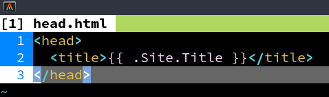
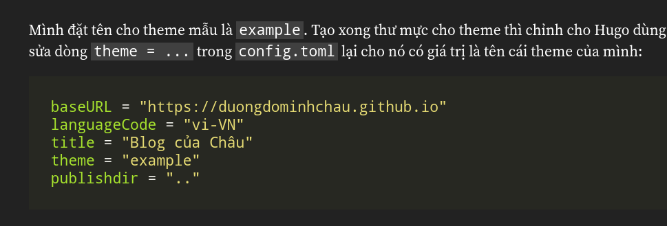

Không biết là do nó tệ thật hay mình đen quá mà kiếm chục cái theme về không
cái nào xài được. Vậy nên mình tự mò cách làm theme luôn, giờ mới có cái để
viết ở đây =))

## Tạo theme mới (chưa xài liền được)
Tạo theme mới bằng `hugo new theme <tên-thư-mục>`, Hugo sẽ tạo thư mục mới
trong `themes`, mình sẽ sửa cái đó cho đúng ý mình. Thư mục được tạo ra sẽ
có dạng như dưới này, trước hết xóa file `layouts/index.html` đi.


Mình đặt tên cho theme mẫu là `example`. Tạo xong thư mực cho theme thì chỉnh
cho Hugo dùng theme mình vừa tạo bằng cách sửa dòng `theme = ...` trong
`config.toml` lại cho nó có giá trị là tên cái theme của mình:

```toml
baseURL = "https://duongdominhchau.github.io"
languageCode = "vi-VN"
title = "Blog của Châu"
theme = "example"
publishdir = ".."
```

Xong rồi, có theme rồi, `hugo server -D` và thử thôi. Đây là kết quả:


Trống trơn không có gì hết, hình trên không có bị lỗi lúc tải đâu =))
Tại vì mình chọn cách tự làm nên ban đầu sẽ không có gì được hiển thị
lên, mình phải tự hướng dẫn cho nó hiển thị nội dung.

## Các thành phần cơ bản của Hugo template engine
Mặc định thì cấu trúc của tất cả các trang sẽ dựa trên cấu trúc được
mô tả trong `layouts/_default/baseof.html`. Dưới đây là nội dung được
Hugo tạo sẵn khi tạo theme mới.

```html
<!DOCTYPE html>
<html>
    {{- partial "head.html" . -}}
    <body>
        {{- partial "header.html" . -}}
        <div id="content">
        {{- block "main" . }}{{- end }}
        </div>
        {{- partial "footer.html" . -}}
    </body>
</html>
```

Nhìn sơ qua thì có chút giống HTML, nhưng mà lại có những cái {{ }}
trong đó, đây là những cái đánh dấu để cho template engine xử lý.
Về nguyên lý hoạt động thì template engine không khác gì PHP, phát
hiện đoạn đánh dấu dành cho nó thì bắt đầu xử lý (đối với PHP thì
dấu hiệu bắt đầu là `<?php` và kết thức là `?>`), sau khi xử lý xong
lấy kết quả thế vào chỗ của đoạn đánh dấu đó.

Những dòng partial ở đây hiểu đại khái là load một đoạn HTML trong file
khác vào vị trí được đánh dấu. Gọi là partial tại vì nó chỉ là một phần
trên trang chứ không phải một trang hoàn chỉnh.

Một thành phần tương tự là block, cũng được sử dụng trong mẫu Hugo có
sẵn. Dòng `{{- partial "header.html" . -}}` đọc là "lấy nội dung file
`header.html` gắn vào đây". Còn với block thì nó thoáng hơn nữa: dòng
`{{- block "main" . }}{{- end }}` đọc là "lấy nội dung block tên `main`
gắn vào đây", còn cụ thể nội dung của cái block đó nằm đâu là tùy mình.

Có partial rồi còn thêm block làm gì cho phiền vậy? Lúc đầu mình cũng
nghĩ vậy, tới khi biết về các dạng trang mà Hugo tạo ra.

## Hiển thị danh sách bài viết ở trang chủ
Hugo phân biệt ra các dạng trang khác nhau. Khi xem một bài viết là
mình đang ở một dạng trang `single`, khi xem danh sách các bài viết
(tất cả bài viết, hoặc theo thể loại, theo thẻ, ...) thì trang được
hiển thị cho mình thuộc loại `list`. Với mỗi dạng trang như vậy mình
sẽ có thể tùy chỉnh cấu trúc trang tùy ý. File tương ứng cho các dạng
này nằm trong thư mục `layouts/_default`.

Trước hết mình sẽ làm cái danh sách bài viết. Để chỉnh cấu trúc cho
dạng trang này cần mở file `layouts/_default/list.html`


Trống trơn. Đây là lý do khi nãy chạy thử không thấy gì hết. Ở phần
trước có block tên là `main` được chèn vào trong `<body>`. Trong này
mình phải định nghĩa block đó cho nó hiện. Để định nghĩa một block,
dùng ``{{ define "tên" }}`, ở đây mình cần tên block là main nên sẽ
thêm ``{{ define "main" }}`` vào `list.html`. Khi kết thúc phần nội
dung của block cần thêm `{{ end }}` vào (giống như `<?php` xong phải
kết bằng `?>` vậy).

viết gì đó vào rồi chạy `hugo server -D` lại xem sao.


Chữ hiện ra rồi, giờ sẽ làm tới phần hiển thị danh sách bài viết.
Hugo cung cấp sẵn rất nhiều giá trị thông qua các biến, ở đây mình
sẽ dùng biến `Pages`, là biến chứa các trang (bài viết cũng được
coi là trang, Hugo không phải chỉ để viết blog nên gọi chung là
trang). Mỗi trang vậy sẽ có các thuộc tính như `RelPermalink`
(đường dẫn tương đối của bài viết), `Content` (nội dung bài viết),
`Summary` (tóm tắt bài viết), `Title` (tiêu đề bài viết), ...

Hugo cũng cung cấp các lệnh điều kiện và lệnh lặp, ở đây mình cần
lặp qua từng trang (bài viết), Hugo có lệnh `range` cho mục đích này.
Ở mỗi lần lặp thì dấu `.` sẽ chỉ đối tượng hiện tại (bài viết hiện tại).

Thêm tiêu đề và tóm tắt lên trang danh sách, hiện đọc tiếp nếu bài
dài hơn phần tóm tắt được hiện.

```html
{{ define "main" }}
	{{ range .Pages }}
		<h2><a href="{{ .RelPermalink }}">{{ .Title }}</a></h2>
		<p>{{ .Summary }}</p>
		{{ if .Truncated }}
			<p><a href="{{ .RelPermalink}}">Đọc tiếp…</a></p>
		{{ end }}
	{{ end }}
{{ end }}
```

Mở lên coi thử thôi!


## Thêm tên website vào header và thanh tiêu đề
Cái này chắc khỏi cần phải chỉ nữa, mở `layouts/partials/header.html`
ra mà sửa thôi.

Thông tin website nằm trong biến `Site`, mình cần tiêu đề thôi nên
dùng `.Site.Title`.


Tương tự, thêm tiêu đề trang bằng cách sửa file `head.html`



Kết quả:


## Hiển thị nội dung bài viết
Lúc này đã có danh sách bài viết, nhưng nếu mở một bài viết cụ thể
lên thì nó vẫn trống trơn. Lý do? Y như cái danh sách bài viết ở
trang chủ, tại mình chưa mô tả cấu trúc trang thôi. Bài viết dùng
cấu trúc được mô tả trong `layouts/_default/single.html`.

Biến trong một trang sẽ khác với biến trong một danh sách. Một số
biến mình dùng:
- `Title`: tên trang (tên bài viết)
- `Content`: nội dung bài viết
- `TableOfContents`: mục lục (Hugo tự tạo, mình không cần viết tay)
- `Date`: ngày được ghi ở phần đầu của bài viết (dòng `date: ...`)
- `Lastmod`: ngày sửa bài viết gần đây nhất. Cái này phải có Git
mới xài được tại nó lấy thời gian từ bên Git.

```html
{{ define "main" }}
	<h1>{{ .Title }}</h1>
	<p>{{ .Date }}</p>
	<h2>Mục lục</h2>
	{{ .TableOfContents }}
	{{ .Content }}
{{ end }}
```

Nội dung bài viết được hiển thị:


Tới đây có thể thấy rõ vì sao có partial rồi lại còn có thêm block.
Trang danh sách bài và trang bài viết có cấu trúc hoàn toàn khác nhau,
nhưng mà vì nó cùng định nghĩa khối main nên đều thế trực tiếp vào
`baseof.html` được hết. Nếu trong `baseof.html` dùng partial thay vì
block thì chỉ có thể dùng file `baseof.html` đó với dạng danh sách
hoặc dạng trang (bài viết) chứ không thể dùng cho cả 2 như bây giờ.

## Thêm file CSS để trang trí
Cuối cùng cũng tới bước hấp dẫn nhất. Để thêm CSS cho trang chỉ việc
sửa file `layouts/partials/head.html`


Tạo file `main.css` trong thư mục `static/css`. Nội dung trong thư mục
`static` này sẽ được đưa ra `publishDir`, vậy nên lúc viết đường dẫn
trong `<head>` mình để `/css/main.css`.

Mình lấy blog này làm ví dụ để trang trí luôn. Bắt đầu với nền tối và
chữ trắng, cùng với lề 2 bên rộng một tí.

```css
body {
	background: #222;
	color: #fff;
	font-family: Source Serif Pro, serif;
	font-size: 16pt;
	padding: 2rem 10%;
}
```


Màu của liên kết quá tối, cần chỉnh lại

```css
/* Links */
a {
	color: #0af;
	text-decoration: none;
}
a:hover {
	text-decoration: underline;
}
```


Có vẻ ổn rồi, giờ xem trong bài viết thôi.


Tên website và tiêu đề bài viết gần nhau quá, lại cùng kích thước nữa.
Thêm đường phân cách xem sao.

```css
header {
	border-bottom: 2px solid #fff;
}
```


Phần đánh dấu code chưa đủ nổi bật:


Thêm cho nó cái background sáng tí:

```css
/* Code */
code {
	background: #404040;
	display: inline-block;
	padding: 0 0.25rem;
}
```


Tốt hơn rồi, nhưng mà nó ảnh hưởng code block:


Loại trừ những thẻ `<code>` trong code block:

```css
/* Code */
:not(pre) > code {
	background: #404040;
	display: inline-block;
	padding: 0 0.25rem;
}
```


Code block lúc này không có lề, nhìn xấu quá, thêm lề cho nó:

```css
.highlight > * {
	padding: 0 2rem;
}
.highlight > :first-child,
.highlight > :last-child {
	padding: 2rem;
}
```



Hình vẫn còn khó phân biệt quá, đặc biệt là hình chụp nội dung trang:


Thêm cho nó cái viền xung quanh cho dễ phân biệt.

```css
/* Images */
img {
	background: #555;
	border-radius: 10px;
	border: 1px solid #fff;
	display: block;
	margin: 1rem auto;
	padding: 10px;
}
```


Lúc này dễ phân biệt hình ảnh với văn bản xung quanh hơn rồi.

Chỉ còn một chi tiết nhỏ nữa thôi: font cho code. Fira Code với mấy cái
ligature nhìn rất đẹp, thêm nó vào nếu có thể thôi:

```css
code, .highlight * {
	font-family: Fira Code, Source Code Pro, Consolas, monospace;
}
```

Đây là trước khi dùng Fira Code:


Và đây là khi dùng Fira Code:


## Một số tùy chỉnh trong `config.toml`
Syntax highlighting: Hugo có rất nhiều bộ màu để tô màu code, mình dùng 
Monokai (mặc định). Nếu muốn thử những bộ màu khác thì vào đây xem:
<https://xyproto.github.io/splash/docs/>. Để dùng một bộ màu thì thêm 
vào `config.toml` đoạn này:

```toml
[markup]
	[markup.highlight]
		style = "<tên-bộ-màu>"
```

Mặc định thì mục lục chỉ được tạo từ `h2` và `h3` (`h1` cho tên bài viết rồi),
thường thì mình dùng tới 3 mức nên sẽ chỉnh `endLevel` của nó thành `4`.

```toml
[markup]
	[markup.tableOfContents]
		endLevel = 4
```

Lưu ý là cùng section thì có thể viết chung, nên muốn chỉnh cả 2 cái trên thì
có thể viết như vầy:

```toml
[markup]
	[markup.highlight]
		style = "solarized-light"
	[markup.tableOfContents]
		endLevel = 4
```

Thêm dòng này để có thể sử dụng `Lastmod` (ngày sửa đổi):

```toml
enableGitInfo = true
```

## Phân trang
Để phân trang chỉ cần duyệt qua `.Paginator.Pages` thay vì `.Pages
như hiện tại. Sau đó thêm template có sẵn của Hugo vào bằng dòng
bên dưới để tạo thanh điều hướng (thanh có các các nút chuyển đến
trang đầu/trước/sau/cuối hoặc số trang cụ thể).

```
{{ template "_internal/pagination.html" . }}
```


Mặc định thì số bài trên mỗi trang là 10 bài, để thay đổi nó cần
đặt giá trị cho `paginate` trong `config.toml`. Ví dụ:

```toml
paginate = 5
```


Mặc định của nó chưa có trang trí gì hết, cần chỉnh lại bằng cách thêm
CSS vào `static/css/main.css`

```css
/* Pagination */
.pagination {
	text-align: center;
}
.pagination .page-item {
	display: inline-block;
}
.pagination .page-item.active a {
	font-weight: bold;
	text-decoration: underline;
}
.pagination .page-item.disabled a {
	color: #666;
}
```

Kết quả:


## Nội dung bị bỏ sót
File `head.html` mình quên viết 2 dòng này, dòng thứ nhất để hiện
tiếng Việt đúng (trên Windows hình như bị vấn đề này), dòng thứ hai
để chữ trên điện thoại không quá nhỏ. Lúc viết bài này mình không
thử 2 trường hợp này nên bỏ sót.

```html
<meta charset="utf-8">
<meta name="viewport" content="width=device-width,initial-scale=1">
```

## Bắt tay vào làm thôi, đọc cái giề
Trên đây mình đã lặp lại từng bước nhỏ từ không có gì đến blog hiện tại mình
đang dùng. Những gì mình viết ở trên chỉ là một phần nhỏ của Hugo, nếu có
thời gian bạn có thể tìm hiểu thêm về những tính năng hữu ích của Hugo trên 
[trang tài liệu chính thức của Hugo](https://gohugo.io/documentation/).

Website ở trên vẫn còn nhiều thứ để làm, chẳng hạn như responsive, lấy
điện thoại xem trang sẽ thấy vấn đề. Thử sửa theme để giải quyết vấn đề
này luôn xem sao.

Bài viết này tới đây là hết rồi, hy vọng các bạn thấy bài viết này hữu ích.
