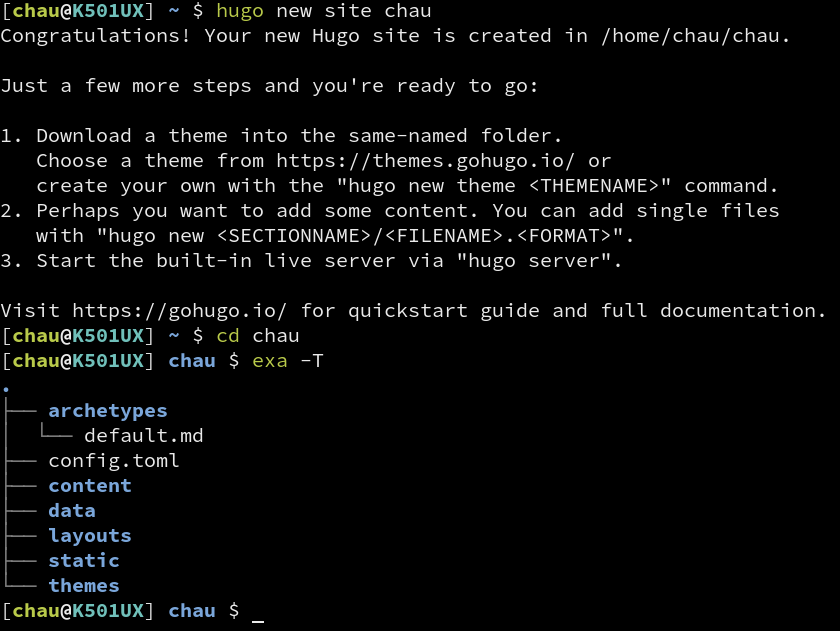
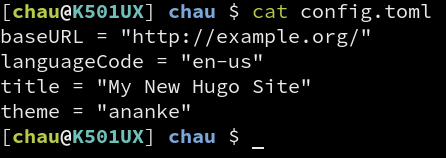
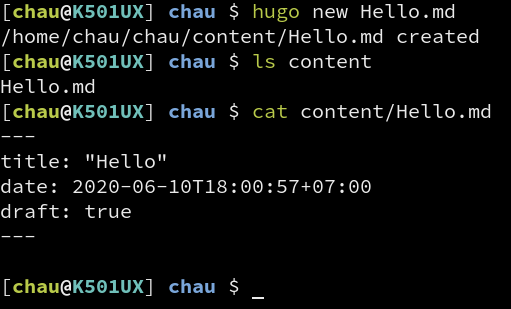
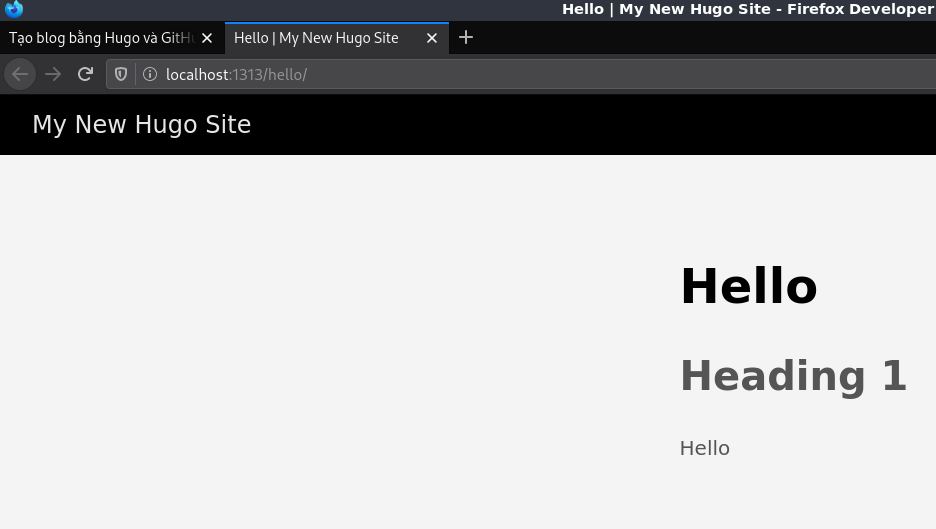

Bài viết này sẽ hướng dẫn cách tạo blog bằng Hugo và host bằng GitHub Pages.
Đây cũng là cách mình đang dùng để viết trang blog này.

## Giới thiệu
Hugo là một static site generator, nói cách đơn giản thì nó giống như trình
biên dịch, chỉ có điều trình biên dịch nhận code vào và cho ra mã máy, còn
Hugo nhận nội dung (thường là Markdown) và sinh ra website hoàn chỉnh. Static
site ở đây có ý nói là nội dung của trang không thay đổi, chứ không phải có ý
là không xài JavaScript.

Có website rồi thì cần tìm hosting để treo nó lên cho người khác truy cập.
GitHub Pages là dịch vụ miễn phí của GitHub cho phép người dùng host web tĩnh
trên đó. Điểm đặc biệt của nó là GitHub bắt buộc người dùng đăng trang web lên
dưới dạng một Git repo, cho nên tất cả nội dung đều được quản lý phiên bản bởi
Git, lỡ có sửa bài viết xong thấy không vừa ý thì vẫn khôi phục về bản cũ được.
Nếu bạn chưa biết cách sử dụng Git thì nên xem bài viết này trước: [Git](Git)

Hai bước này độc lập nhau nên là làm cái nào trước cũng được. Hugo chỉ phụ trách
sinh ra nội dung website, còn GitHub Pages thì phụ trách hiển thị nội dung website
cho người khác truy cập. Ở đây mình sẽ bắt đầu từ GitHub Pages trước vì nội dung
về nó ngắn hơn.

## Lập một trang web với GitHub Pages
Trước tiên là cần có tài khoản GitHub, nếu chưa có thì [đăng ký ở đây]().

Tạo một repo với tên `<username>.github.io` (thay `<username>` bằng tên đăng nhập
của tài khoản GitHub đang dùng, ví dụ tài khoản GitHub của mình có tên đăng nhập là
`duongdominhchau` thì tạo repo tên `duongdominhchau.github.io`). Viết tên khác với
tên đăng nhập của tài khoản GitHub là nó sẽ không hoạt động.

Sau khi tạo repo rồi thì clone nó về máy. Tạo file `index.html` với nội dung bất kỳ,
ví dụ như

```html
Chạy rồi nè!
```

Xong rồi `commit` file đó vào repo và `push` lên GitHub.

Truy cập địa chỉ `<username>.github.io` sẽ nếu thấy nó hiện nội dung vừa viết.
Sau khi `push` nội dung trang web sẽ chưa được cập nhật liền mà phải đợi vài
giây sau, nên nếu truy cập vào sớm quá chưa thấy gì thì chờ vài giây sau tải
lại xem sao. Thông thường thì bên mình mất khoảng 5–15 giây để web cập nhật
nội dung mới.

Đến đây là xong phần GitHub Pages rồi, giờ sang Hugo.

## Cài đặt và sử dụng Hugo
### Cài đặt
Trước hết phải tải Hugo về đã. Nếu xài Linux thì chắc tự biết phải làm gì rồi,
tìm package tên `hugo` rồi cài thôi. Còn nếu xài Windows thì lên GitHub rồi
tìm bản cho Windows mà tải về xài (https://github.com/gohugoio/hugo/releases),
chọn cái `hugo` hay `hugo_extended` đều được, cái sau có thêm SASS/SCSS thôi,
thiếu cũng không sao, không quan trọng lắm.

Trên Windows lúc tải về giải nén ra sẽ có file `hugo.exe`, đem nó bỏ vào
một thư mục (ở đâu cũng được, quăng trực tiếp ở `C:\` cũng không sao), xong
thêm thư mục đó vào biến môi trường `PATH`. Thêm ra sao thì tự goole đi.

Hugo không có giao diện đồ họa, nên lúc xài nó trên Windows thì chịu khó
bật `cmd` hoặc `PowerShell` lên.

### Tạo site mới
Tạo website mới bằng lệnh `hugo new site <tên-thư-mục>` (thay `<tên-thư-mục>`
bằng tên muốn dùng).

Sau khi chạy lệnh này Hugo sẽ tạo thư mục với tên được truyền vào ở trên. Di
chuyển vào trong đó bằng lệnh `cd <tên-thư-mục>`. Lúc này thư mục sẽ có những
thứ như trong hình bên dưới.



Hiện tại chỉ cần biết `config.toml` là file cấu hình, `content` là thư mục chứa
các file nội dung, `themes` là thư mục chứa theme.

### Thêm theme
Trong bài này mình sẽ dùng Ananke để làm mẫu. [Tải
file này về](https://github.com/budparr/gohugo-theme-ananke/archive/master.zip),
giải nén vào thư mục `themes`, sau đó đổi tên thư mục giải nén được thành `ananke`.

Mở file `config.toml` thêm dòng `theme = "ananke"` vào (`ananke` là tên
thư mục nằm trong thư mục `themes`).



Phần này đang làm quen với Hugo nên dùng theme có sẵn, phần sau của bài viết
này sẽ hướng dẫn cách tự viết theme.

### Tạo bài viết thử nghiệm
Khi đang ở trong thư mục của site được Hugo tạo, chạy lệnh `hugo new Hello.md`
để tạo một bài viết mới. Sau khi thực hiện lệnh này sẽ thấy có file `Hello.md`
trong thư mục `content`.



Mở file lên viết **thêm** đoạn này vào cuối (đừng xóa phần có sẵn trong đó):

```markdown
# Heading 1
Hello
```

Sau đó chạy lệnh `hugo server -D` và truy cập vào <localhost:1313/hello> để
xem kết quả.



### Kết hợp Hugo và GitHub Pages
Để làm được chuyện này có nhiều cách, mình chỉ hướng dẫn cách mình đang dùng.
Trong repo của trang trên GitHub của bạn, chạy lệnh `hugo new site hugo-src`
để tạo thư mục `hugo-src` (dùng chứa mấy file nguồn cho Hugo). Để người ta vừa
ghé trang `<username>.github.io` là thấy được blog liền thì nội dung Hugo tạo
ra phải được đặt ở thư mục ngoài cùng, mà nếu để mấy file của Hugo chung với
trang web nó sinh ra thì khó quản lý nên mình gom về một thư mục như ở trên.

Kế tiếp là sửa file `config.toml`.
- Thay `baseURL` thành `<username>.github.io`
- `languageCode` để nguyên nếu viết tiếng Anh, còn dùng tiếng Việt thì
đổi giá trị nó thành `vi-VN`.
- Đổi tiêu đề website lại bằng cách sửa giá trị của `title`.
- Chỉnh thư mục xuất file thành thư mục bên ngoài bằng cách thêm dòng
`publishDir = ".."`. `..` là thư mục cha của thư mục hiện tại, lúc Hugo
chạy thì thư mục hiện tại là `hugo-src` và `..` lúc đó chính là thư mục
`<username>.github.io`. Đổi như vầy để người ta truy cập trang của mình
là thấy ngay nội dung được Hugo sinh ra.

Đây là file `config.toml` của mình sau khi sửa:

```toml
baseURL = "http://duongchau.github.io"
languageCode = "vi-VN"
title = "Website dùng làm mẫu cho bài viết về Hugo"
publishDir = ".."
```

Còn phần sau đó thì như đã hướng dẫn ở trên, thêm cái theme, viết nội dung
rồi build. Lúc chạy thử bằng `hugo server -D` sẽ thấy tất cả bài viết, nhưng
lúc build Hugo sẽ không làm như vậy. Mặc định là bài nháp hoặc bài có ngày giờ
ở tương lai sẽ không được build. Ở đầu file được Hugo tạo ra lúc chạy
`hugo new <tên-file>` có đoạn như vầy:

```markdown
---
title: "Hello"
date: 2020-06-11T16:28:11+07:00
draft: true
---
```

`draft: true` nghĩa là bài này là bài nháp, sửa nó thành `false` để công bố
bài viết (publish).

Để build trang chỉ việc chạy lệnh `hugo` (`hugo server -D` là để coi thử thôi,
lệnh này mới là build thật nè). Chạy xong thì commit toàn bộ các file ở đây
rồi push lên. Chờ vài giây sau là trên GitHub sẽ cập nhật nội dung trang theo.

### Tự tạo theme cho website
Thôi phần này chắc dời qua bài riêng đi, chứ không thì dài lắm.
[Xem bài viết ở đây](quá-trình-xây-dựng-hugo-theme-cho-blog-này)
